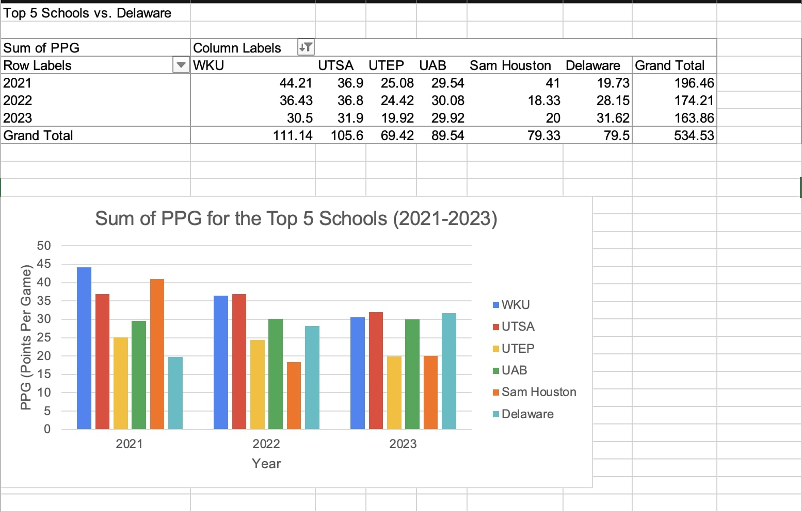
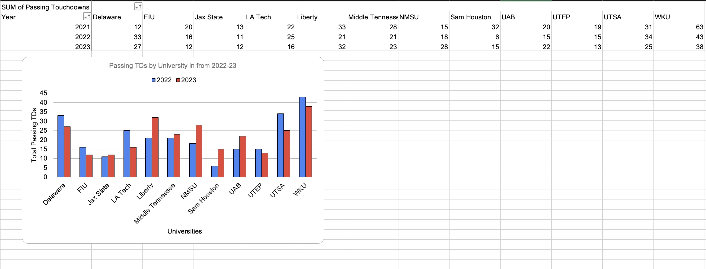
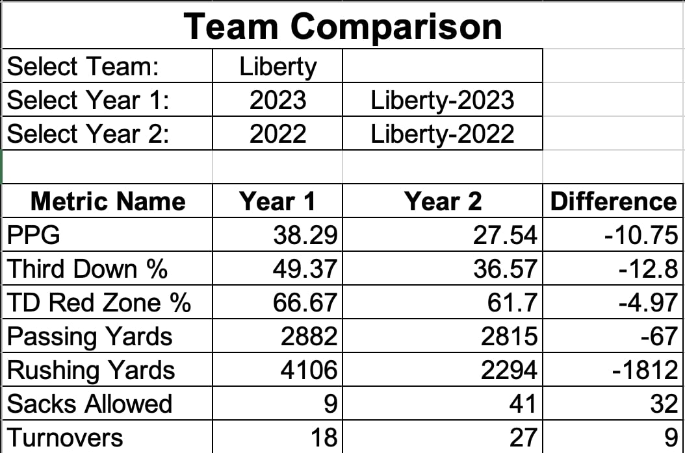

# College Football Performance Analysis
<a href="Andrew Garcia - CUSA Data Graphs.xlsx" download>View Project Excel File</a>

### Project Overview
This project analyzes college football team performance data from 2021 to 2023 to uncover trends, strengths, and areas for improvement. Using a dataset of team statistics (e.g., points per game, third-down conversions, passing/rushing yards, sacks, and turnovers), I developed two tools to provide actionable insights for coaches, analysts, or enthusiasts: a performance heatmap and a dynamic comparison tool.

__Tool 1__: Pivot Charts & Pivot Tables

Using PivotTables, I analyzed Points Per Game (PPG) and Passing Touchdowns (Passing TDs) to uncover trends across college football teams from 2021 to 2023, providing a clear view of offensive performance. I created a PivotTable summarizing total PPG and total Passing TDs per team, with filters for year and team to enable dynamic exploration of the data. To visualize these insights, I generated Pivot Charts, including a bar chart tracking the trend of all PPG over the three seasons, which highlighted the top 5 performers compared to Delaware, and a bar chart comparing Passing TDs across teams from 2022-2023, showcasing leaders like WKU for their consistent passing efficiency. These charts help coaches and analysts identify which teams excel in scoring and passing effectiveness, offering actionable insights for strategic improvements.

__Tool 2__: Team Performance Heatmap (Conditional Formatting)

I created a heatmap to visualize team performance across key metrics, enabling quick identification of trends and outliers. Using conditional formatting in Excel, I applied color scales to metrics like PPG, rushing yards, and turnovers—green for strong performance (e.g., high PPG, low sacks) and red for weaker performance. I added rules to highlight outliers (e.g., PPG above 45 in bold green) and filters for interactivity, allowing users to focus on specific teams or years. For example, Liberty’s 2023 performance stood out with a PPG of 68.87 (green) but showed a concern with 25 turnovers (yellow), while UAB’s 32 turnovers in 2023 were flagged as a red outlier. This tool demonstrates my ability to transform raw data into visually intuitive insights using conditional formatting.

__Tool 3__: Team Performance Comparison Across Seasons (VLOOKUP)

I built a dynamic comparison tool to evaluate a team’s performance across two seasons, highlighting improvements or declines. Using VLOOKUP and MATCH functions, I created a sheet where users can select a team and two years via dropdowns, and the tool retrieves metrics like PPG, rushing yards, and sacks allowed. A helper column in the raw data (combining team and year) ensured accurate lookups, while MATCH dynamically identified column positions for each metric. I calculated differences between years, applied conditional formatting to highlight improvements (green) and declines (red), and added a bar chart for visual comparison. For instance, comparing Liberty’s 2023 and 2022 seasons revealed a 25-point PPG increase (68.87 vs. 43.87) but a 7-turnover increase, indicating a trade-off between offensive growth and ball security. This tool showcases my skills in using VLOOKUP, MATCH, and interactive features to deliver actionable insights.

#### Key Skills Demonstrated:

- Data Visualization: Used conditional formatting to create an intuitive heatmap for quick performance analysis.
- Dynamic Lookups: Leveraged VLOOKUP and MATCH to build a flexible comparison tool that adapts to changing data structures.
- Interactivity: Incorporated filters and dropdowns to enhance user experience and usability.
- Analytical Thinking: Derived insights from raw data, such as identifying Liberty’s offensive improvement and turnover concerns.
- Excel Proficiency: Demonstrated advanced techniques like helper columns, color scales, and chart integration.

#### Impact:

These tools provide practical solutions for sports analysts to assess team performance, track progress over time, and identify areas for strategic improvement, making complex data accessible and actionable.

